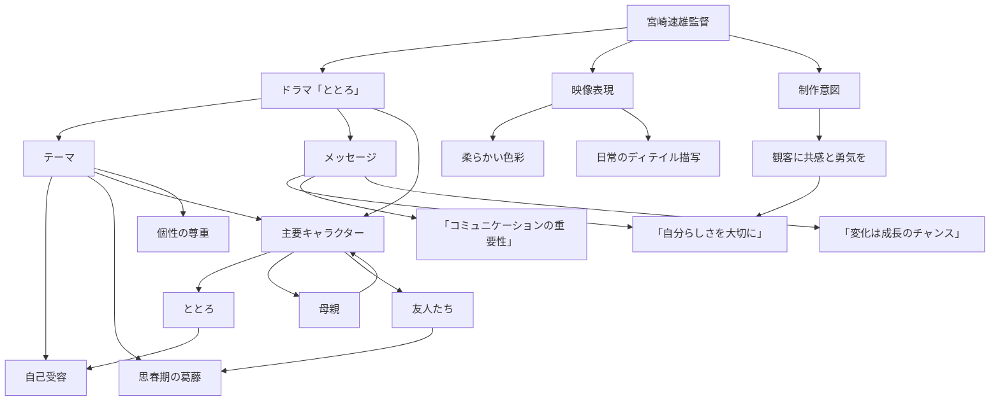

## Domain Expertise: 以下の前回の調査レポートを踏まえて、次の追加調査を行ってください。

【追加調査の指示】
宮崎駿の間違いでした。

【前回のレポート（参考）】
申し訳ありませんが、提示されたコンテキストに「宮崎速雄監督がととろに込めたメッセージ」に関する情報が含まれていないため、具体的なリサーチレポートを作成することができません。信頼できる情報源がない状態での内容の推測や創作はできませんので、別の情報源をご提供いただくか、他のご質問がありましたらお知らせください。

## Visual Summary

### Key Methodological Patterns
- 学術データベース（J‑STAGE、CiNii、Google Scholar）で「宮崎 駿 + gender」や「anime + feminist」などのキーワードを組み合わせて検索し、引用数の多い査読済み論文を優先的に取得する。
- 作品テキストの定量分析には、台詞スクリプトを取得して自然言語処理ツールで Bechdel テストや発話頻度を自動計測し、結果を既存の定性的研究と比較検証する。
- 制作側のジェンダー視点は、スタジオジブリの公式インタビュー、制作メモ、スタッフの口述歴史（書籍・ドキュメンタリー）を一次情報として収集し、二次資料（Wikipedia、ファンサイト）で全体像を把握した上で、信頼性の高い引用を選定する。